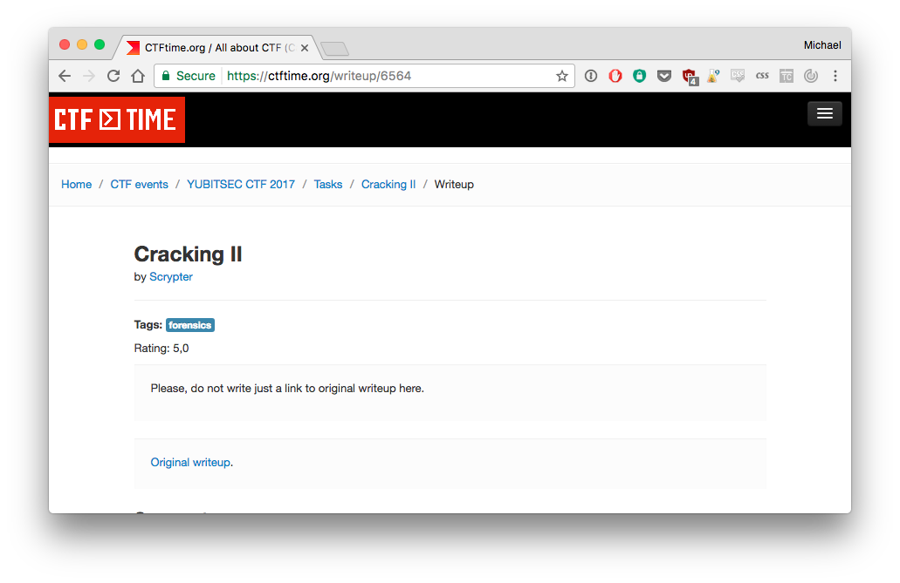
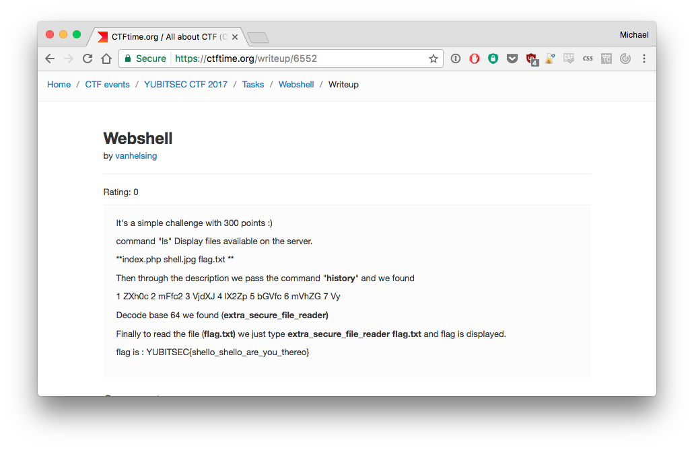

# Projet Capture The Flag - Web Mining 2017 - HES-SO//Master

### Auteurs

Michael Caraccio, Joel Gugger et Nicolas Huguenin

## 1. Contexte et objectifs du projet

Nous souhaitons mettre en place un index permettant de catégoriser et recherché parmi des outils et des techniques utilisés lors de CTF (Capture the flag).

Le site [CTF time](https://ctftime.org/) nous permet de recenser une très grande partie des concours les plus importants au niveau mondial ainsi qu'une partie des solutions proposées par les équipes ayant participé. Cela nous permet aussi d'avoir accès aux différents liens vers des blogs ou encore des dépôts git, généralement sur [GitHub](https://github.com) et en libre accès.

La structure du site CTF Time est connue d'avance, nous pouvons donc indiquer à notre crawler les liens à visiter et nous pouvons rendre intelligente la récolte des données en ciblant certaine partie des pages du site.

### 1.1 Objectifs

- Créer un crawler intelligent en fonction de la structure du site
- Cibler de manière précise les contenus à extraire du site
- Détecter un maximum d'informations sur le contenu des writeups (langage utilisé, outils utilisés, etc.)
- Créer un index permettant de faire une recherche efficace

### 1.2. Structure du projet

Le projet sera décomposé en 3 parties :

1. Le crawler nous permettant de découvrir le site
2. Un indexe nous permettant de traiter les informations (pour ce faire nous devrons créer des dictionnaires nous permettant de catégoriser les contenus)
3. Une interface permettant de récupérer l'information

## 2 Données à analyser
### 2.1 Main page
La page à analyser est la page suivante : [https://ctftime.org/writeups](https://ctftime.org/writeups). Celle-ci contient les informations suivantes :

1. **Event** -> Nom de l'événement
2. **Task** -> Nom de la tâche
3. **Tag** -> Hashatag ou autre mot concernant la tâche
4. **Author team** -> L'auteur du writeup
5. **Action** -> Lien vers le writeup

### 2.2 Task page
Depuis la main page, on peut cliquer sur le lien de la tâche. Cela nous donnera la liste de tous les writeups concernant cette tâche. En effet, tout le monde peut proposer des writeups concernant une tâche. Cela est intéressant, car il permet de nous donner plusieurs résolutions possibles.

Exemple : [https://ctftime.org/task/2411](https://ctftime.org/task/2411)

La page contient les informations suivantes :

1. **Action** -> Lien vers la page du writeup
2. **Rating** -> Note
3. **Author** team -> Nom de la team

### 2.3 Writeup page
Cette page contient soit un lien vers le site contenant le writeup :

Ou alors le writeup est directement affiché sur la page :

### 2.4 Catégories

1. Web Hacking
2. Digital Puzzles
3. Cryptography
4. Stegonography
5. Reverse Engineering
6. Binary Analysis
7. Mobile Security
8. Forensics
9. Cracking
10. Networking

### 2.5 Listes d'outils

- Liste d'outils de Kali, trier par catégorie : [Tools](http://tools.kali.org/tools-listing)
- Liste d'outils catégorisée : [Tools](http://gexos.github.io/Hacking-Tools-Repository/)
- Liste d'outils catégorisés : [Tools](https://github.com/carpedm20/awesome-hacking)
- Liste d'outils catégorisée : [Awesome ctf](https://github.com/apsdehal/awesome-ctf)

### 2.6 Listes de writeup (autre que ctftime)

- [Awesome Pentest](https://github.com/enaqx/awesome-pentest)
- [Awesome Hacking](https://github.com/carpedm20/awesome-hacking)
- [Awesome Security](https://github.com/sbilly/awesome-security)
- [Awesome Web Hacking](https://github.com/infoslack/awesome-web-hacking)
- [Awesome Forensics](https://github.com/Cugu/awesome-forensics)

- [write-ups-2017](https://github.com/ctfs/write-ups-2017)
- [write-ups-2016](https://github.com/ctfs/write-ups-2016)
- [write-ups-2015](https://github.com/ctfs/write-ups-2015)
- [write-ups-2014](https://github.com/ctfs/write-ups-2014)
- [write-ups-2013](https://github.com/ctfs/write-ups-2013)

- [Github Team - SixStars](https://github.com/sixstars/CTF)
- [Github Team -  smokeleeteveryday](https://github.com/smokeleeteveryday/CTF_WRITEUPS)
- [Github Team - VulnHub](https://github.com/VulnHub/ctf-writeups)

## 3. Planification, répartition du travail
La planification et la répartition du travail a été effectuée dans la section "Projects" > "[Planification](https://github.com/nichuguen/WEM-Project/projects/1)" du GitHub.

## 4. Fonctionnalités / cas d’utilisation
### 4.1 Use cases

1. **Recherche simple**
- Selon les mots clés entrés, cela nous affichera une liste de page web correspondante à notre recherche.
2. **Recherche avancée**
- On peut cocher la / les catégories qui nous intéressent (web, crypto, forensics, etc).
- Préciser le langage de programmation
3. **Type d'affichage**
- Liste de lien. Mets en avant les liens. Comme une recherche Google standard.
- Liste de lien avec outils utilisés. À côté de chaque lien, on affichera l'outil.

### 4.2 Indexations

- Textes de la page ..
- Language de programmation de la page
- Outils utilisés : Cela nécessite d'avoir une base de données des outils et de les "détecter" dans la page
- Selon le texte dans la page, il faut pouvoir définir une catégorie

## 5. Techniques, algorithmes et outils utilisés
### 5.1 Languages et outils

- **Languages** : Python (crawler, indexation, API), Javascript (interface utilisateur)

- **Librairies** :

[Scrapy](https://scrapy.org/)
An open source and collaborative framework for extracting the data you need from websites.
In a fast, simple, yet extensible way.

[Bootstrap](http://getbootstrap.com/)
Bootstrap is the most popular HTML, CSS, and JS framework for developing responsive, mobile first projects on the web.

## 6. Conclusion
TODO
